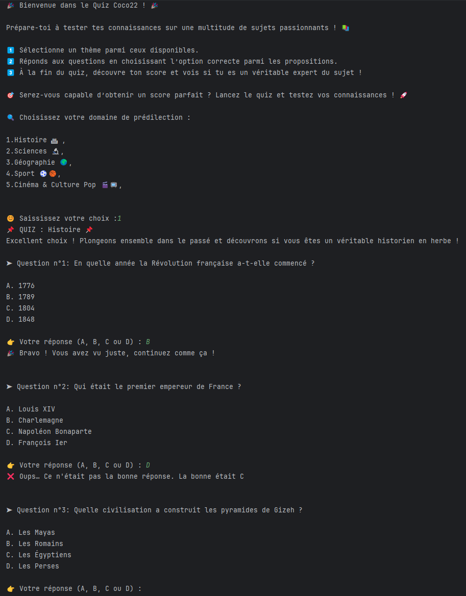
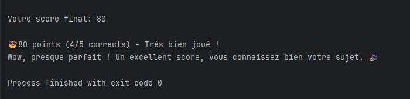

## 📌 Bot de Quiz - Java

# 🧠 Testez vos connaissances avec ce bot de quiz interactif en Java !
Ce programme propose des questions de culture générale sur différents thèmes, 
calcule un score et fournit un retour personnalisé en fonction des réponses du joueur.



## 📖 Fonctionnalités

✅ Sélection de thèmes parmi :

1. 🏛 Histoire
2. 🔬 Sciences
3. 🌍 Géographie
4. ⚽ Sport
5. 🎬 Cinéma & Culture Pop

✅ Questions à choix multiple (QCM)
✅ Score calculé en fonction des réponses
✅ Feedback dynamique après chaque réponse
✅ Message final en fonction du score obtenu
✅ Expérience interactive en console



## 🚀 Installation et Exécution

# 1️⃣ Prérequis :
- Avoir Java (JDK 8 ou plus) installé sur votre machine 
- Un éditeur de texte ou un IDE (ex : VS Code, IntelliJ IDEA, Eclipse)
# 2️⃣ Cloner le projet
Si vous utilisez Git, exécutez cette commande dans votre terminal :

```shell
git clone https://github.com/votre-repo/bot-quiz-java.git
cd bot-quiz-java
```
Sinon, téléchargez le code source en .zip et extrayez-le.

# 3️⃣ Compiler et exécuter le programme
Dans le terminal, placez-vous dans le dossier du projet et exécutez :

```shell
javac QuizBot.java
java QuizBot
```
# 👨‍💻 Contribution
Si vous souhaitez améliorer ce bot, voici comment contribuer :

1. Forkez le projet
2. Créez une nouvelle branche : git checkout -b ma-fonctionnalite
3. Ajoutez vos modifications
4. Envoyez une pull request

# 📜 Licence
Ce projet est sous licence MIT, vous êtes libre de l’utiliser et de le modifier.

# Auteur
Dan Elenga (dancodeur) - Développeur devOps.
